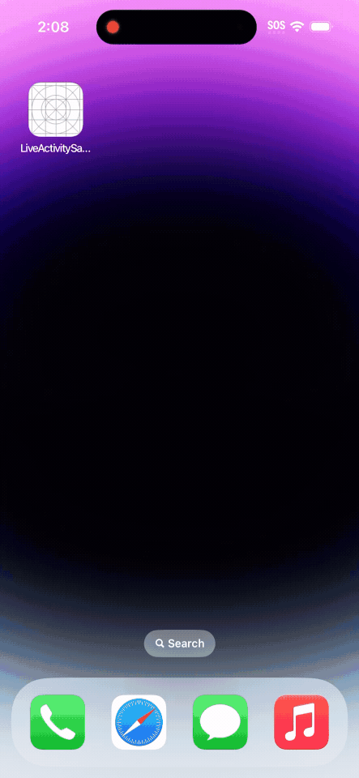

  <a href="https://documentation.onesignal.com/docs/onboarding-with-onesignal" target="_blank">Quickstart</a>
  &nbsp;&nbsp;•&nbsp;&nbsp;
  <a href="https://onesignal.com/" target="_blank">Website</a>
  &nbsp;&nbsp;•&nbsp;&nbsp;
  <a href="https://documentation.onesignal.com/docs" target="_blank">Docs</a>
  &nbsp;&nbsp;•&nbsp;&nbsp;
  <a href="https://github.com/OneSignalDevelopers" target="_blank">Examples</a>
   
  

# OneSignal Live Activity Sample

OneSignal makes engaging customers simple and is the fastest, most reliable service to send push notifications, in-app messages, SMS, and emails.

This project demonstrates  [Live Activities](https://developer.apple.com/documentation/activitykit/displaying-live-data-with-live-activities) for iOS

## 🚦 Getting started
Several useful resources for getting up and running with Live Activities
- [Live Activity Project Setup Guide](https://documentation.onesignal.com/docs/how-to-send-a-live-activity)
- [Live Activities Quickstart Guide](https://documentation.onesignal.com/docs/live-activities-quickstart)
- [Live Activities Channel](https://documentation.onesignal.com/docs/live-activities)
- [Permission Prompting](https://documentation.onesignal.com/docs/permission-prompting)

# ❤️ Developer Community

For additional resources, please join the [OneSignal Developer Community](https://onesignal.com/onesignal-developers).

Get in touch with us or learn more about OneSignal through the channels below.

- [Follow us on Twitter](https://twitter.com/onesignaldevs) to never miss any updates from the OneSignal team, ecosystem & community
- [Join us on Discord](https://discord.gg/EP7gf6Uz7G) to be a part of the OneSignal Developers community, showcase your work and connect with other OneSignal developers
- [Read the OneSignal Blog](https://onesignal.com/blog/) for the latest announcements, tutorials, in-depth articles & more.
- [Subscribe to us on YouTube](https://www.youtube.com/channel/UCe63d5EDQsSkOov-bIE_8Aw/featured) for walkthroughs, courses, talks, workshops & more.
- [Follow us on Twitch](https://www.twitch.tv/onesignaldevelopers) for live streams, office hours, support & more.

## Show your support

Give a ⭐️ if this project helped you, and watch this repo to stay up to date.
